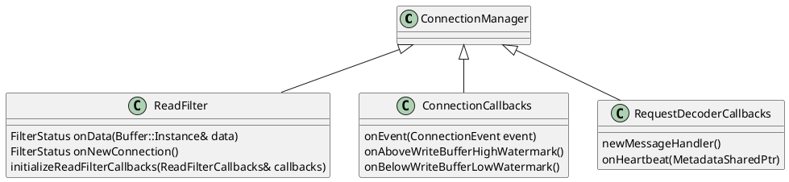

ConnectionManager 是 MeataProtocol Proxy 的入口类。想要了解 MetaProtocol Proxy 的实现原理，可以从该类着手。

## Envoy Network Filter 介绍

MetaProtocol Proxy 框架部分实现为 Envoy 中的一个 Network Filter。Enovy 通过 Listener 接收 Downstream 的连接，然后将收取到的 TCP 数据流发送给 TCP filter chain 中的 MetaProtocol Proxy 处理。

Envoy Network Filter 机制：


Envoy 将从 Downstream 套接字中读取到的数据放到 buffer 中，传递给 Network Filter chain 进行处理，由 Network Filter chain 处理后，一般会由 chain 中最后一个 filter 发送给 Upstream。

注意：

* 上图来自于 [Enovy 文档](https://www.envoyproxy.io/docs/envoy/latest/intro/life_of_a_request)，图中 Network filter chain 中最后一个 Filter 是 HCM（HTTP Connection Manager）。在 Aeraki Mesh 中，该 Network filter chain 中其实只有一个 filter，就是 MetaProtocol Proxy。

* Listener 还有一个 Listener filter chain，用于在 Network filter chain 前进行一些公共逻辑的处理，例如通过 tls inspector 拿到 sni 和 application protocol，http 协议嗅探等。

在 Aeraki Mesh 中，MetaProtocol Proxy 是 Network Filter Chain 中唯一的 Filter。 MetaProtocol Proxy 在收到 Downstream 数据后，会采用其相应的应用协议的 codec 实现进行解码，然后再将解码得到的元数据（Metadata）传递给本地限流、全局限流、路由等七层 filter 进行处理。进行处理后通过 Router 将消息发送到 Upstream。


Envoy 中有两种类型的 Network Filter：

* ReadFilter：在收到 Downstream 的数据后，Enovy 会将数据中从 Downstream 套接字中读出，并依次调用 ReadFilter 对这些数据进行处理。
* WriteFilter：在向 Downstream 套接字写入数据前，Envoy 会依次调用 WriteFilter 对数据进行处理后，再写入 Downstream。


MetaProtocol Proxy 是一个 ReadFilter 类型的 Network Filter。（MetaProtocol Proxy 是 Network Filter Chain 中最后一个 Filter，直接接收 Upstream 的响应消息并返回给 Downstream，因此没有必要实现对 Response 数据进行处理的 WriteFilter。）

ReadFilter 接口包含下面的方法：

```cpp
class ReadFilter {
public:

  // 将从 Downstream 连接中读取到的数据传递给 filter 进行处理
  virtual FilterStatus onData(Buffer::Instance& data, bool end_stream) PURE;

  // 创建 Downstream 连接时会调用该方法
  virtual FilterStatus onNewConnection() PURE;

  // Enovy 传递一个 ReadFilterCallbacks 回调接口给 ReadFilter。ReadFilter 可以通过该
  // 回调接口从 Envoy 框架层获取一些有用的信息。例如该 ReadFilter 关联的 Dowstream Connection。
  virtual void initializeReadFilterCallbacks(ReadFilterCallbacks& callbacks) PURE;
};
```

`ReadFilterCallbacks` 继承了 `NetworkFilterCallbacks`，MetaProtocol Proxy 的 ConnectionManager 主要使用到了 `NetworkFilterCallbacks` 中的 connection 方法来获取 Downstream 连接。

```cpp
class ReadFilterCallbacks : public virtual NetworkFilterCallbacks {
public:
  不重要，略过......
};
```

```cpp
class NetworkFilterCallbacks {
public:
  
  // 通过该方法获取 Network Filter 关联的 Downstream Connection
  virtual Connection& connection() PURE;
};
```

## Connection Manager 结构

Connection Manager 实现了三个重要的接口: 

* Network::ReadFilter 对 Downstream 连接中读取到的数据进行处理，包括解码和调用七层 filter。
* MetaProtocolProxy::RequestDecoderCallbacks 为 MetaProtocol 的七层 filter 提供的回调接口。
* Network::ConnectionCallbacks Downstream 连接回调接口，主要用于连接事件（连接和断开）和流控的处理。



### Downstream 请求处理

在 Network::ReadFilter 接口的 onData 方式实现中对来自 Downstream 的数据进行处理。Envoy 会将 Downstream 连接中收到的数据放到一个 buffer 中，通过 回调 onData 方法的参数传递给 Connection Manager。

```cpp
Network::FilterStatus ConnectionManager::onData(Buffer::Instance& data, bool end_stream) {

  // 对来着 Downstream 连接中的数据进行分发处理
  dispatch();

  不重要，略过......

  // MetaProtocolProxy 是 Network Filter Chain 中的最后一个 Filter，不再继续执行。
  return Network::FilterStatus::StopIteration;
}
```
MetaProtocol Proxy 在 onData 方法中调用 dispatch 方法，在 dispatch 方法中会循环调用 decoder 的 decode 方法。decoder 依次处理 buffer 中的请求，处理完的数据会被 decoder 从 buffer 中移除。如果一个请求未接收完整，或者 buffer 中的数据被全部处理完毕，decoder 会通过 underflow 标志告诉 Connection Manager 需要更多数据。 Connection Manager 会退出本次 onData 处理，envoy 收到更多数据后将再次调用 Connection manager 的 onData 方法。

```cpp
void ConnectionManager::dispatch() {
  不重要，略过......

  try {
    bool underflow = false;
    while (!underflow) {
      decoder_->onData(request_buffer_, underflow);
    }
    return;
  } 

  不重要，略过......
}
```

### Envoy 流控机制

Envoy 为 TCP filter 提供了一个[流控机制](https://github.com/envoyproxy/envoy/blob/main/source/docs/flow_control.md)。其原理是为 TCP filter 的 buffer 设置了一个最大值（水位线），并在 buffer 中实际的数据大小超过该值，或者数据大小从该值之上回落到到该值以内时通过 `ConnectionCallbacks` 回调通知 TCP filter。

MetaProtocol Proxy 实现了 `ConnectionCallbacks` 接口，并在 `ReadFilter` 的 `initializeReadFilterCallbacks` 回调方法中向 Downstream connection 注册了该回调。

```cpp
void ConnectionManager::initializeReadFilterCallbacks(Network::ReadFilterCallbacks& callbacks) {
  read_callbacks_ = &callbacks;
  // 向 Downstream connection 注册流控相关的回调方法
  read_callbacks_->connection().addConnectionCallbacks(*this);
  read_callbacks_->connection().enableHalfClose(true);
  read_callbacks_->connection().setBufferLimits(BufferLimit);
}
```

当 buffer 中的数据超过水位线时，Envoy 通过 `onAboveWriteBufferHighWatermark` 回调通知到 MetaProtocol Proxy。该回调说明此时 MetaProtocol Proxy 的处理速度慢于 Downstream 的数据发送速度，造成数据积压。此时 MetaProtocol Proxy 会调用 `connection.readDisable(true)` 方法，要求 Envoy 暂停从 Downstream 中读取数据，将数据保留在内核的 TCP 接收 buffer 中，最终通过 TCP 的拥塞控制对 Downstream 造成背压（Backpressure），降低 Downstream 的发送速率。

当 buffer 中的数据被 MetaProtocol Proxy 处理，低于水位线后，Envoy 通过 `onBelowWriteBufferLowWatermark` 回调通知到 MetaProtocol Proxy。此时 MetaProtocol Proxy 会调用 `connection.readDisable(false)` 方法，要求 Envoy 恢复从 Downstream 中读取数据。

```cpp
void ConnectionManager::onAboveWriteBufferHighWatermark() {
  read_callbacks_->connection().readDisable(true);
}

void ConnectionManager::onBelowWriteBufferLowWatermark() {
  read_callbacks_->connection().readDisable(false);
}
```

## 扩展阅读
* [Envoy 流控机制介绍](https://github.com/envoyproxy/envoy/blob/main/source/docs/flow_control.md)
* [Envo 请求生命周期介绍](https://www.envoyproxy.io/docs/envoy/latest/intro/life_of_a_request)
* [How to Write Envoy Filters Like a Ninja! — Part 1](https://blog.envoyproxy.io/how-to-write-envoy-filters-like-a-ninja-part-1-d166e5abec09)
* [Taming a Network Filter](https://blog.envoyproxy.io/taming-a-network-filter-44adcf91517)


我的博客即将同步至腾讯云开发者社区，邀请大家一同入驻：https://cloud.tencent.com/developer/support-plan?invite_code=3lidtv8h8qckw