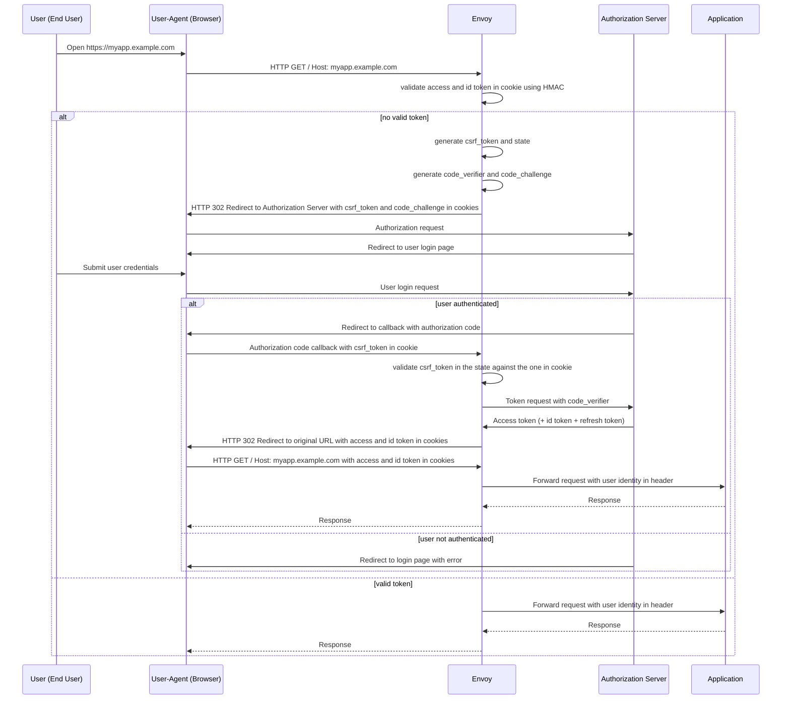
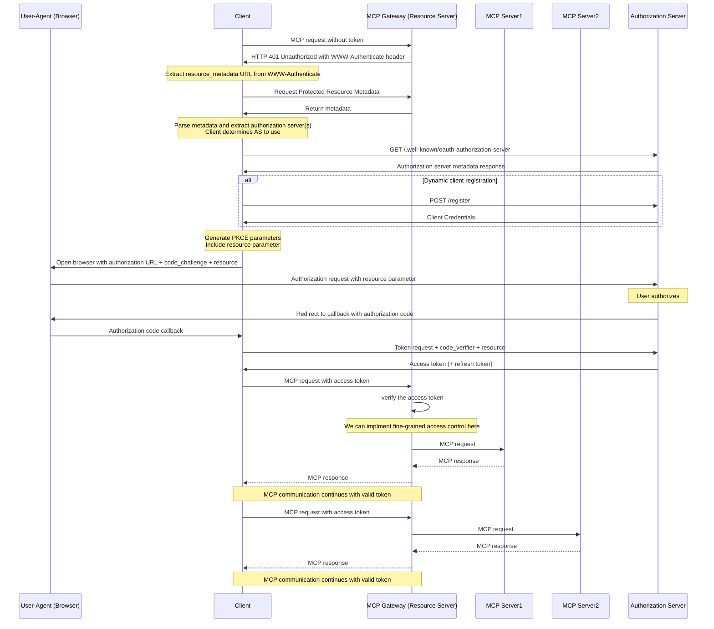

Oftentimes, I find myself spending a lot of time jumping between different files to understand the codebase while reviewing a PR or
writing a new feature — even when I originally wrote a good chunk of that code myself.

In this sense, human brain feels like an old computer with just 64K of RAM. It's constantly swapping data in and out because
there just isn't enough memory. Before it can do any serious work, it has to reload all the context back into memory — a slow and sometimes frustrating process, especially when you’re doing it over and over.

On the flip side, our brains are really good at understanding the big picture — and that’s where diagrams shine. So I put
these together to help myself quickly get a clearer picture of Envoy Gateway’s architecture whenever I’m reviewing a PR or building something new.

If you’re trying to understand how Envoy Gateway works under the hood, you might find them useful too.

I'll keep updating this post to include more diagrams.

## Overview

## Envoy OAuth Code Flow

## AI Gateway MCP Auth Flow

Enable centralized access control at the gateway for backend MCP servers that do not natively support the MCP authorization spec:

